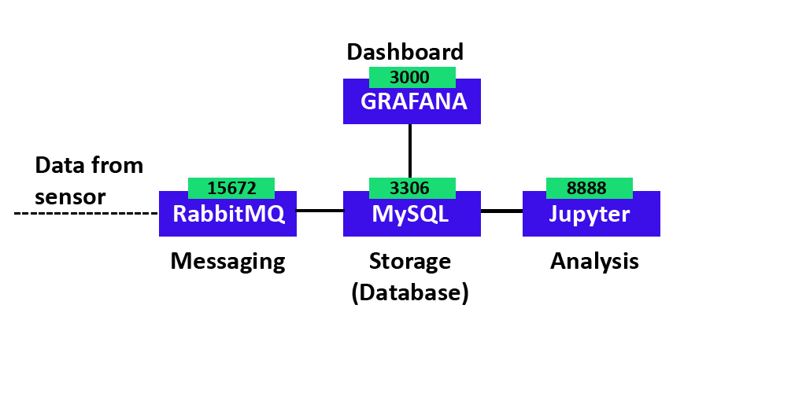

# AIOT-platform

## Service



1. A database service: ***MySQL*** with port ```3306```  
 Relational database for managing devices, a time series database for storing sensor tags.  
 (Using port ```8080``` to access the service ```adminer``` for managing the database.)

2. A dashboard service: ***Grafana*** with port ```3000```  
Capability to visualize the device topology, sensor tags and events.

3. A messaging service: ***RabbitMQ*** with port ```15672```  
Receiving and buffering the sensor tags.

4. An analysis service: ***Jupyter*** with port ```8888```  
Building models (rule-based or AI-based), analysing the data and mining the useful patterns from the data.


## Operation
Using Docker Compose is basically a three-step process:

Define your app's environment with a Dockerfile so it can be reproduced anywhere.
Define the services that make up your app in docker-compose.yml so they can be run together in an isolated environment.
Lastly, run docker compose up and Compose will start and run your entire app.

Clone this repository:
```
git clone https://github.com/khairulhawani/AIOT-platform.git
``` 

Run this command inside the directory to pull the image:
```
docker-compose up -d
```

You can check the container working by checking with:
```
{your_ip_address or localhost}:8080 --> Database Adminer
{your_ip_address or localhost}:3000 --> Grafana
{your_ip_address or localhost}:8888 --> Jupyter
{your_ip_address or localhost}:15672 --> RabbitMQ
```

Run this command inside the directory to start:
```
docker-compose start
```

Run this command inside the directory to stop:
```
docker-compose stop
```

Run this command inside the directory to clean:
```
docker-compose down
```
