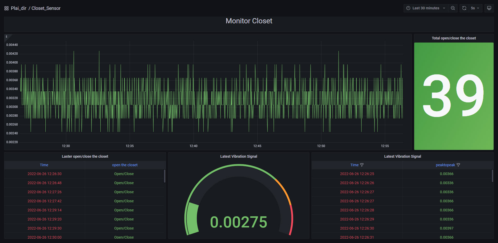

# AIOT-platform
## Detect Vibration of Closet

This project includes 4 part
## Collect the Data
We collect the data from WISE-750 that can collect the vibration. Then, we send the data to the MySQL by using RabbitMQ. 

## Training the Model
After we got raw data in the database, we train the data by using Support Vector Mechine (SVM) using SVC. We split the data into training set and test set in random in 80:20. So, the training set has 50,430 samples and test set has 12,608 samples. For the accuracy score of the trained model, we got the score as 0.9967. 

Then, we save the model as ```model_SVC.pkl```. In this part, we use Jupiter Notebook to implement the code and we also upload it into this floder as ```SVC.ipynb```. 

We train the model by using peak to peak column to predict the status of closet that is opening (closing) and closed as 1 and 0.

## Predict the Data
After we got the model, next we use this model to predict the data that collect from WIRE-750. The code provide in ```predict.py```. 

This part you can run this file via CMD when you want to mount or unmount the sensor.

## Display the Dashboard
We use Grafana as a dashboard to display the result in real-time.
